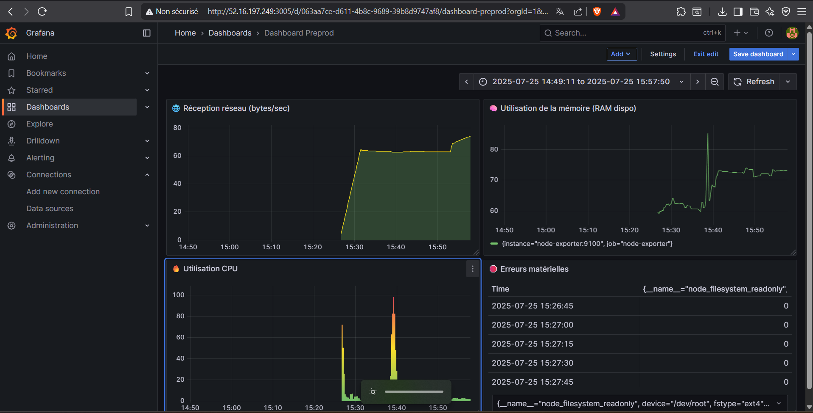

# 🧪 Projet DevOps – Gestion de Produits (Juillet 2025)

## 🌐 URLS

- 🔴 **Production** : [http://52.16.197.249:4004](http://52.16.197.249:4004)
- 🟠 **Préproduction** : [http://52.16.197.249:4002](http://52.16.197.249:4002)
- 🟠 **Graphana Prod** : [http://52.16.197.249:3006/](http://52.16.197.249:3006/)
- 🟠 **Prometheus Prod** : [http://52.16.197.249:9092/](http://52.16.197.249:9092/)
- 🟠 **Graphana Preprod** : [http://52.16.197.249:3005/](http://52.16.197.249:3005/)
- 🟠 **Prometheus Preprod** : [http://52.16.197.249:9091/](http://52.16.197.249:9091/)

---

## 👥 Équipe

- Enzo **GIVERNAUD**
- Hugo **MACEDO**

---

## 🧾 Description

Ce projet est une application web complète de gestion de produits développée dans le cadre d’un module DevOps. Elle permet :

- l'inscription et la connexion d’utilisateurs,
- la gestion de produits par les propriétaires,
- l’ajout de commentaires par tout utilisateur,
- un déploiement multi-environnement (prod & préprod),
- le suivi de métriques système et applicatives,
- une CI/CD complète (tests, build, déploiement),
- l’upload d’image sur S3,
- une base de données PostgreSQL dans Docker,
- une interface frontend performante et modulaire.

---

## 📄 Fonctionnalités

### 🔐 Authentification & rôles

| Rôle       | Permissions principales                               |
|------------|--------------------------------------------------------|
| Owner      | Créer / Modifier ses produits                         |
| Standard   | Commenter n’importe quel produit                      |

- Auth via cookies `HttpOnly` sécurisés
- Middleware d’auth backend
- Provider de routes protégées côté frontend

### 🧭 Pages de l’application

1. **Homepage**
   - Nombre total d’utilisateurs inscrits
   - Module d’inscription / connexion
   - Nombre total de produits créés

2. **Dashboard utilisateur**
   - Affichage & mise à jour des infos personnelles
   - Liste de ses produits
   - Liste de ses commentaires

3. **Page des produits**
   - Liste de tous les produits disponibles
   - Accès à la fiche détaillée d’un produit

4. **Page produit**
   - Image du produit (via S3)
   - Titre
   - Description
   - Liste des commentaires

---

## 🧱 Stack technique

| Côté        | Stack / outils                                      |
|-------------|------------------------------------------------------|
| Frontend    | React + Vite + TypeScript                           |
| Backend     | Node.js + Express + TypeScript                      |
| BDD         | PostgreSQL (dans Docker)                            |
| Auth        | Cookies HttpOnly sécurisés                          |
| Uploads     | AWS S3 (upload via middleware)                      |
| CI/CD       | GitHub Actions                                      |
| Déploiement | Docker + EC2 (2 envs : prod & preprod)             |
| Monitoring  | Prometheus + Grafana + Node Exporter                |

---

## 🗃️ Structure de la base de données

```sql
CREATE SCHEMA IF NOT EXISTS app_schema;
SET search_path TO app_schema;

CREATE TABLE IF NOT EXISTS users (
  id SERIAL PRIMARY KEY,
  name TEXT NOT NULL,
  email TEXT UNIQUE NOT NULL,
  password TEXT NOT NULL,
  role TEXT NOT NULL DEFAULT 'standard',
  created_at TIMESTAMP DEFAULT NOW()
);

CREATE TABLE IF NOT EXISTS products (
  id SERIAL PRIMARY KEY,
  user_id INTEGER REFERENCES users(id) ON DELETE CASCADE,
  title TEXT NOT NULL,
  description TEXT,
  price NUMERIC(10,2),
  created_at TIMESTAMP DEFAULT NOW(),
  image_url TEXT
);

CREATE TABLE IF NOT EXISTS comments (
  id SERIAL PRIMARY KEY,
  user_id INTEGER REFERENCES users(id) ON DELETE CASCADE,
  product_id INTEGER REFERENCES products(id) ON DELETE CASCADE,
  content TEXT NOT NULL,
  created_at TIMESTAMP DEFAULT NOW(),
);
```

---

## 📦 Architecture

* Backend découpé en routers : `users`, `products`, `comments`
* Middleware d’authentification
* Middleware pour upload S3
* Frontend structuré par **pages + composants**, avec approche **Atomic Design** et principes **SOLID**

---

## 🔧 Développement local

### 1. Cloner le repo & installer PNPM

```bash
git clone ...
cd projet-devops
corepack enable
pnpm install
```

### 2. Créer les fichiers `.env`

#### À la racine :

```env
POSTGRES_PORT=5434
BACKEND_PORT=3001
FRONTEND_PORT=4001
```

#### Dans `backend/.env.local` :

```env
POSTGRES_USER=postgres
POSTGRES_PASSWORD=postgres
POSTGRES_DB=postgres
POSTGRES_HOST=localhost
POSTGRES_PORT=5434
```

### 3. Lancer la base de données seule (optionnel)

```bash
docker compose up -d db --build
```

### 4. Lancer toute l’application via Docker

```bash
docker compose up -d --build
```

### 5. Lancer uniquement le backend en local (optionnel)

```bash
cd backend
pnpm install
pnpm dev
```

> Le backend utilise la base PostgreSQL Docker sur `localhost:5434`.

### 6. Lancer uniquement le frontend en local (optionnel)

```bash
cd frontend
pnpm install
pnpm dev
```

---

## 🔁 CI/CD (GitHub Actions)

* Lint, test et build sur chaque push
* Build et push Docker images
* Déploiement sur preprod seulement au push sur main
* Déploiement sur prod seulement à la création d'un tag de release
* Déploiement automatique :

  * **Préproduction** : sur push `main`
  * **Production** : sur `tag` Git

---

## 📊 Monitoring

* Stack : **Prometheus + Grafana + Node Exporter**
* Métriques collectées :

  * Nombre de connexions
  * Nombre de produits créés
  * Nombre de commentaires
  * CPU, RAM, latence, erreurs
  * Logs système

> Captures d’écran des dashboards graphana de preprod :




---

## 🧪 Tests

* Tests unitaires et d’intégration
* Lint automatique
* Tests exécutés dans la CI

---

## 🧠 Bonus (UX / Dev)

* Upload image produit via S3
* Frontend responsive
* Routes protégées côté frontend (provider + redirect)
* Composants réutilisables typés en TypeScript
* Séparation des responsabilités claire entre services, composants et routes

---

## 📜 Politique de branches Git

* `main` : stable – production
* `develop` : préproduction
* `feature/*` : nouvelles features
* `user/*` : environnements utilisateurs (tests, démo...)

---

## Le gros + de notre projet

La combinaison EC2 + S3 + docker + deploiment CI/CD via github est une vraie preuve de nos magnifiques capacités de devops

---

## 🏁 Merci !

Projet réalisé dans le cadre du module **DevOps – Juillet 2025**
Formation : Master IWID - IIM - A4


